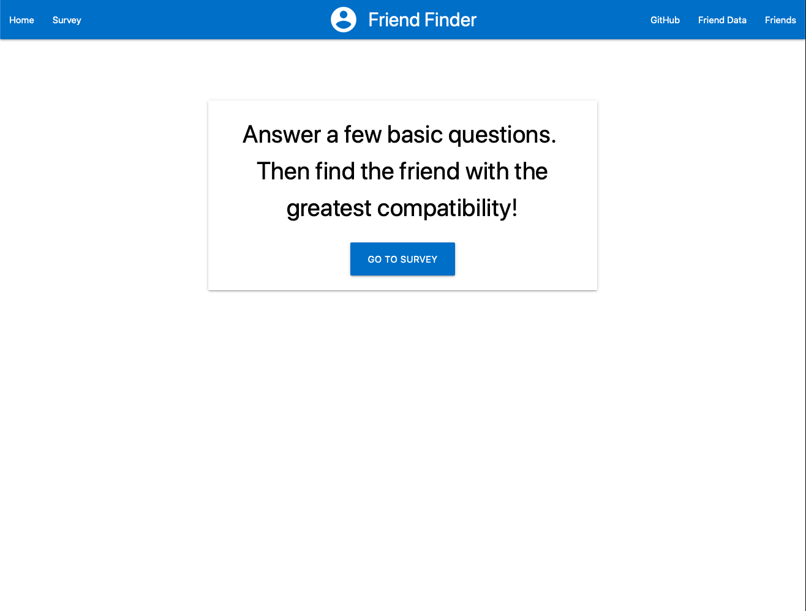
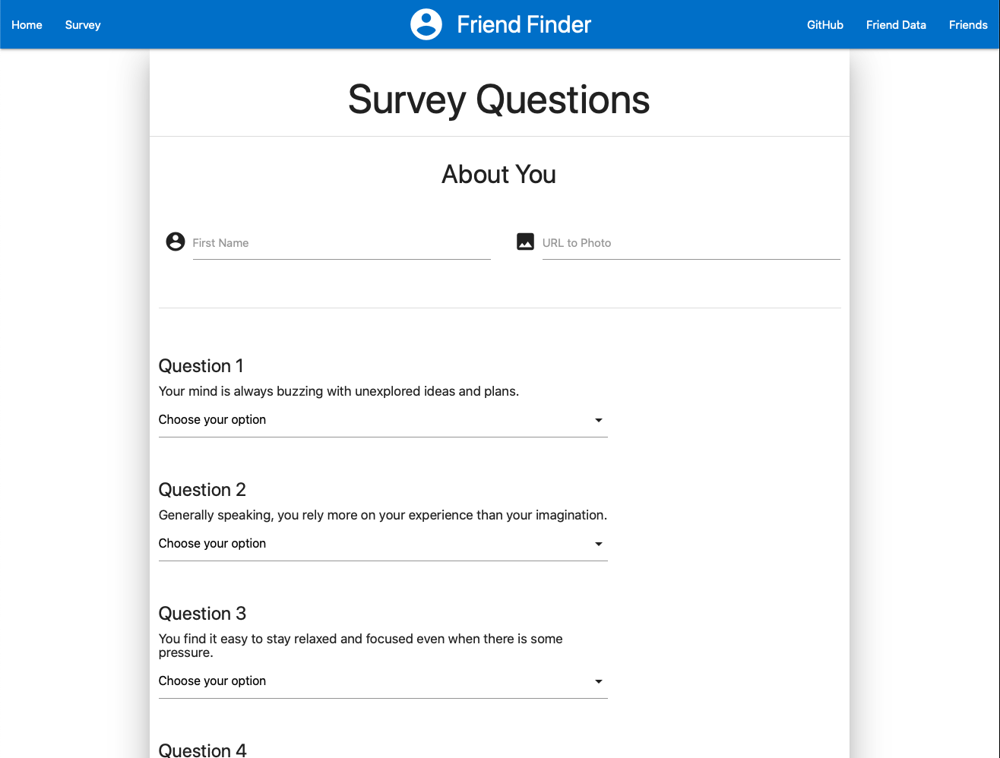

# Friend Finder

Friend Finder is a Heroku hosted application that allows a users to find a friend match based off survey questions. The answers will be scored against existing users' in the Friend Finder database. Once the user completes the survey and submits their answers, Friend Finder will notify them with a match. 

## Technologies used:

* HTML / CSS ([Materialize](https://materializecss.com))
* Javascript / jQuery

## npm Packages:
* [Express](https://www.npmjs.com/package/express)

## Getting Started 

https://young-badlands-22013.herokuapp.com

From the homepage, select the button to "Go to Survey". There you will enter your name and a url to a photo of yourself. Next will be ten questions to determine your match. Once you complete the questions, select the submit button. A modal will appear with your determined match. Close the modal to reset the survey. 

## Screenshots

Index Page

Survey

## Author
* **JC Lenz** 